# 🧠 Probabilistic Inference of Information Cascades on Social Media

**Author:** Prajwal Mahanawar  
**Institution:** University of Limerick  
**Supervisor:** Dr. David O’Sullivan  
**Degree:** MSc in Data Science and Statistical Learning (2025)  

---

## 📘 Project Overview

This repository contains the source code, simulation outputs, and figures from my MSc thesis:  
**_Probabilistic Inference of Information Cascades on Social Media_**.

The study investigates how information diffuses through social networks and how to reconstruct hidden propagation paths when only activation times are observed.  
It combines **forward simulation** using the **Independent Cascade Model (ICM)** on **Erdős–Rényi (ER)** networks and **inverse reconstruction** using **Goel et al. (2016)**’s single-parent heuristic.

The goal is to assess how accurately reconstructed cascades capture the true diffusion structures by comparing metrics such as cascade size, mean depth, and structural virality.

---

## 🧩 Objectives

- Simulate diffusion on ER graphs using the Independent Cascade Model (ICM).  
- Analyse cascade behaviour under varying densities and infection probabilities.  
- Reconstruct cascade trees using deterministic single-parent heuristics.  
- Evaluate reconstruction accuracy using:
  - Cascade size distributions  
  - Mean and maximum depth  
  - Structural virality  

---

## ⚙️ Methodology

### 1️⃣ Network Generation
- Random networks created using **Erdős–Rényi G(n,p)** model.  
- Parameters: `n = 500–1000`, `p = 0.01–0.05`.  
- Ensured average degree `k̄ > 1` to stay above the percolation threshold.

### 2️⃣ Independent Cascade Model (ICM)
- Each active node gets one chance to activate each neighbour with probability `p_infect`.  
- Simulated in **R** using `igraph`, `tidyverse`, and `CascadeSimulatoR`.  
- Monte Carlo experiments produce cascade size and depth distributions.

### 3️⃣ Cascade Reconstruction
- Adopted **Goel et al. (2016)** method based on **temporal ordering + neighbourhood constraint**.  
- For each activated node, parent = neighbour active in the previous generation.  
- Generated reconstructed cascade trees for accuracy comparison.

### 4️⃣ Evaluation Metrics

| Metric | Description |
|---------|--------------|
| **Cascade Size** | Number of activated nodes |
| **Mean/Max Depth** | Distance from root to leaves |
| **Structural Virality** | Average pairwise node distance (Goel et al., 2016) |

---

## 🧪 Simulations and Results

### 🧩 Simulation 1 – Possible Activations in a Ring Network
Illustrates the sequential node activations in a 6-node ring graph.
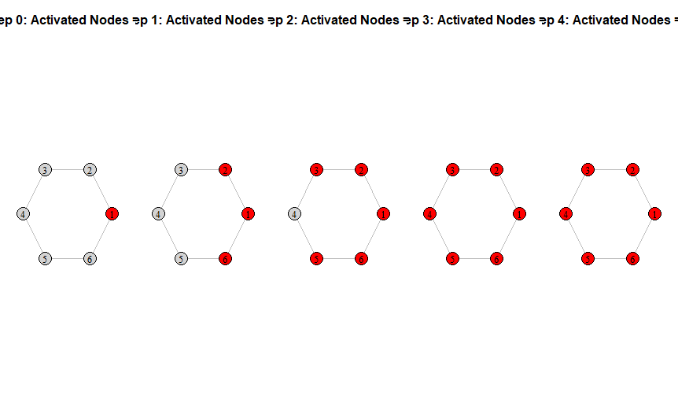

### 🕸️ Ring Network Formation
Base topology used for initial diffusion experiments.
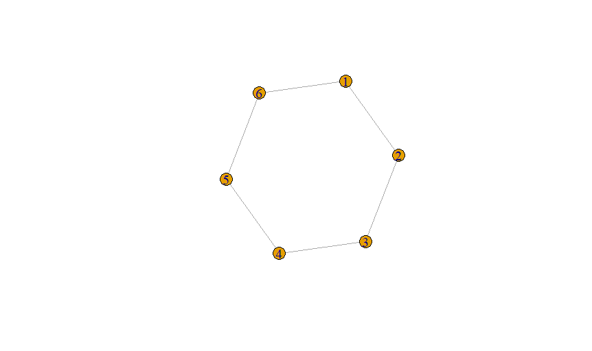

### 📈 Simulation 2 – Cascade Size Distribution (Log-Log Scale)
Shows exponential decay in cascade size frequencies on the ring network.
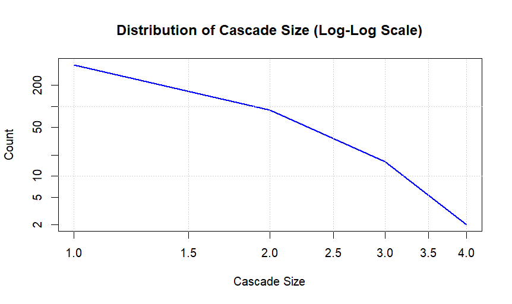

### ⏱️ Simulation 3 – Cascade Size Distribution (max_steps = 2000)
Longer simulations smoothen heavy-tailed distribution trends.
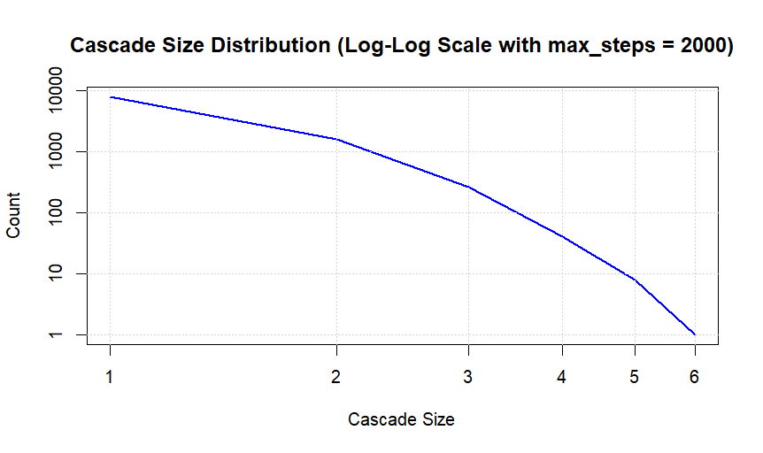

### 🔴 Simulation 4 – Cascade Propagation on ER Network
Cascade spreading visualized step-by-step.
| Step 0 | Step 1 | Step 2 |
|:--:|:--:|:--:|
| 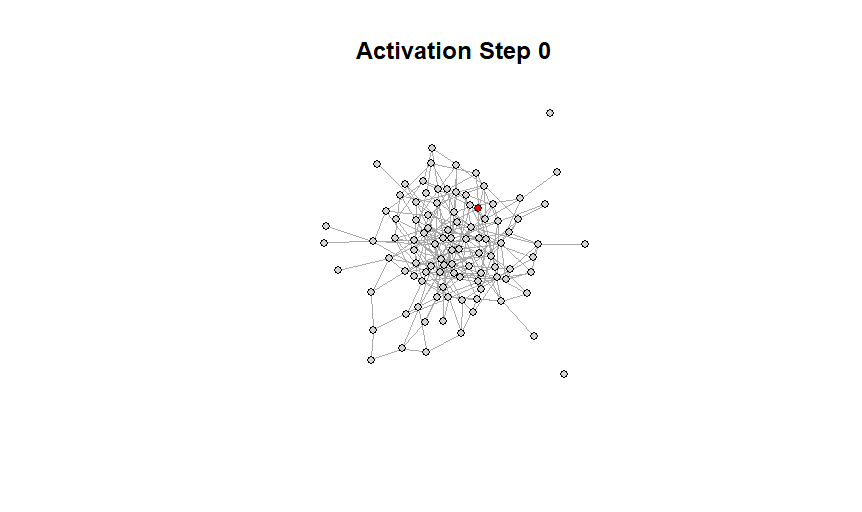 | 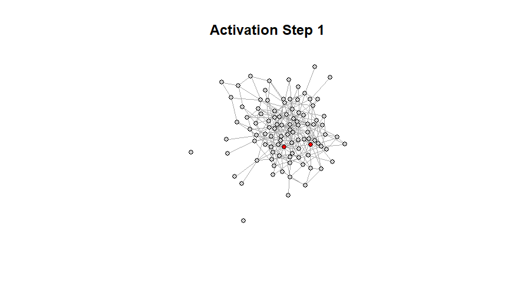 | 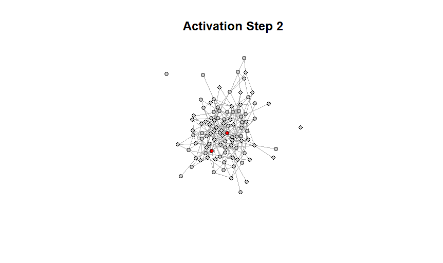 |

### 📊 Cascade Size Distribution (ER Network)
Log-log cascade size distributions showing exponential falloff.
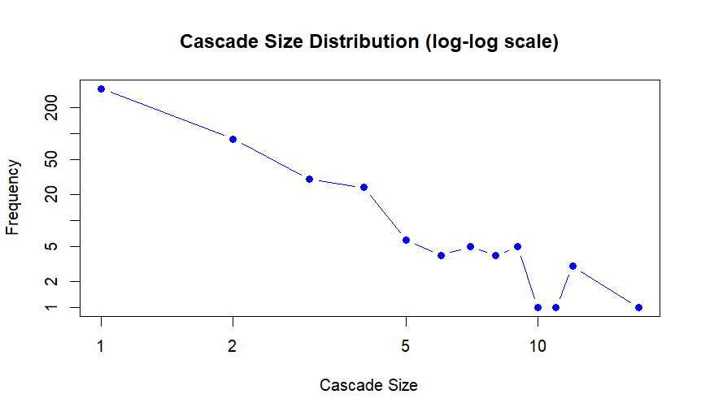

### 🌈 Simulation 5 – Cascade Size Distributions for Different p Values
As infection probability increases, cascades grow larger and more frequent.
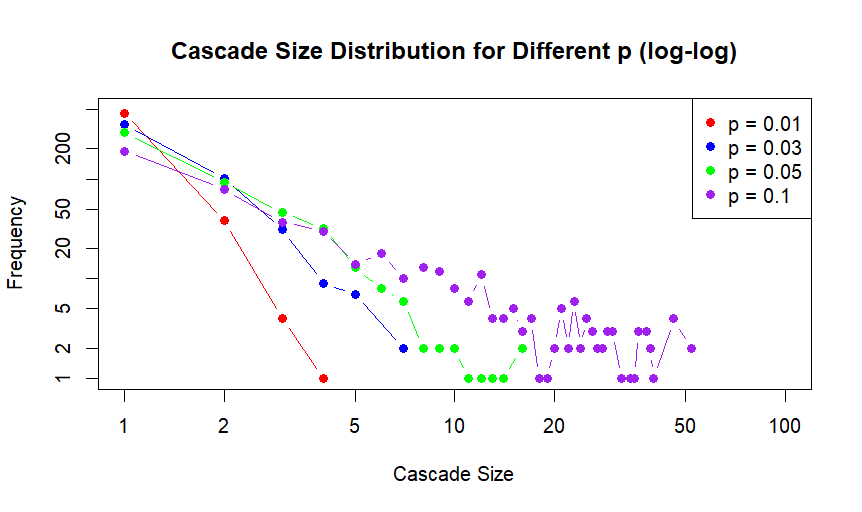

### 🌳 Simulation 6 – Example Cascade Tree (True Cascade)
Visual representation of one simulated cascade tree (sim_id = 77).
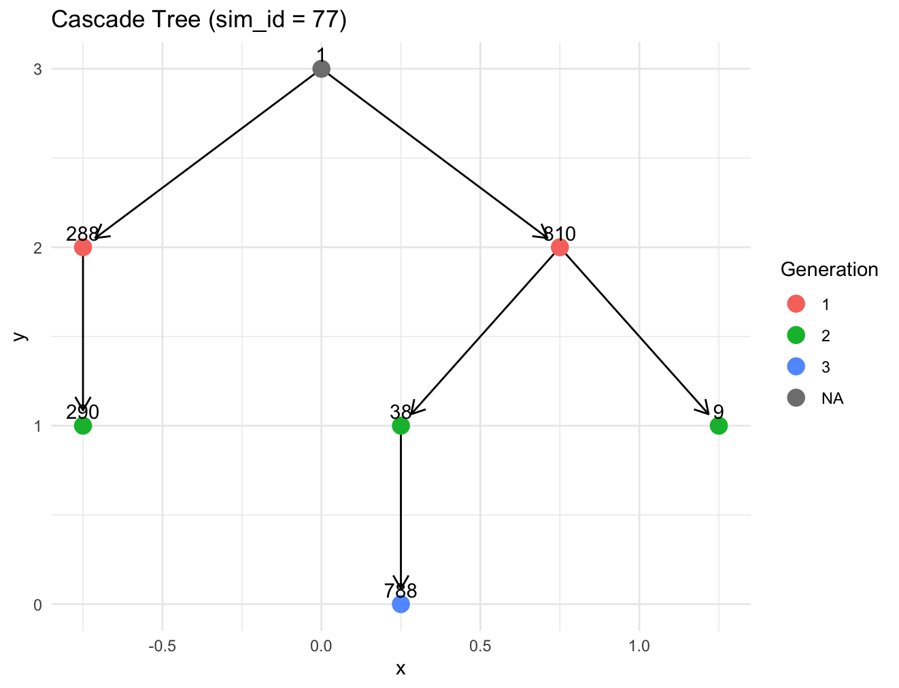

---

## 🔁 Reconstruction Experiments

### 🧠 Simulation 7 – Reconstructed Cascade Tree (sim_id = 32)
A reconstructed tree inferred from activation data using the Goel et al. (2016) heuristic.
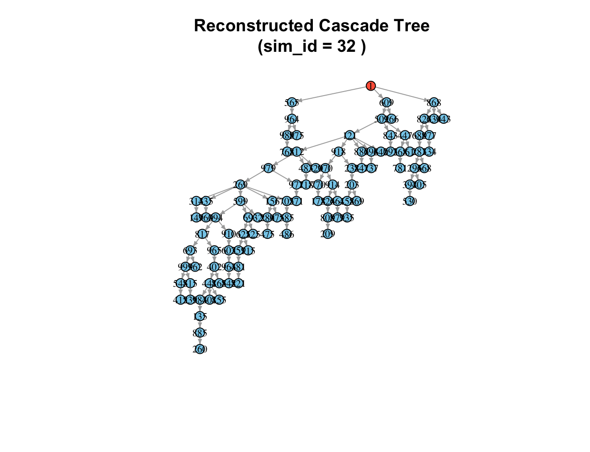

### 📏 True vs Reconstructed Cascade Mean Depth
Comparison of mean depth distributions showing similar structural patterns.
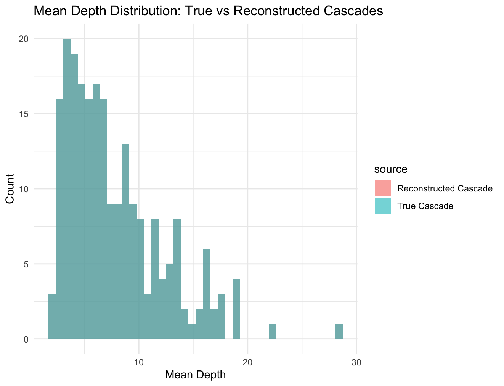

### 📉 True vs Reconstructed Cascade Size Distributions (Log-Log)
Overlay of true and reconstructed cascade sizes confirming statistical similarity.
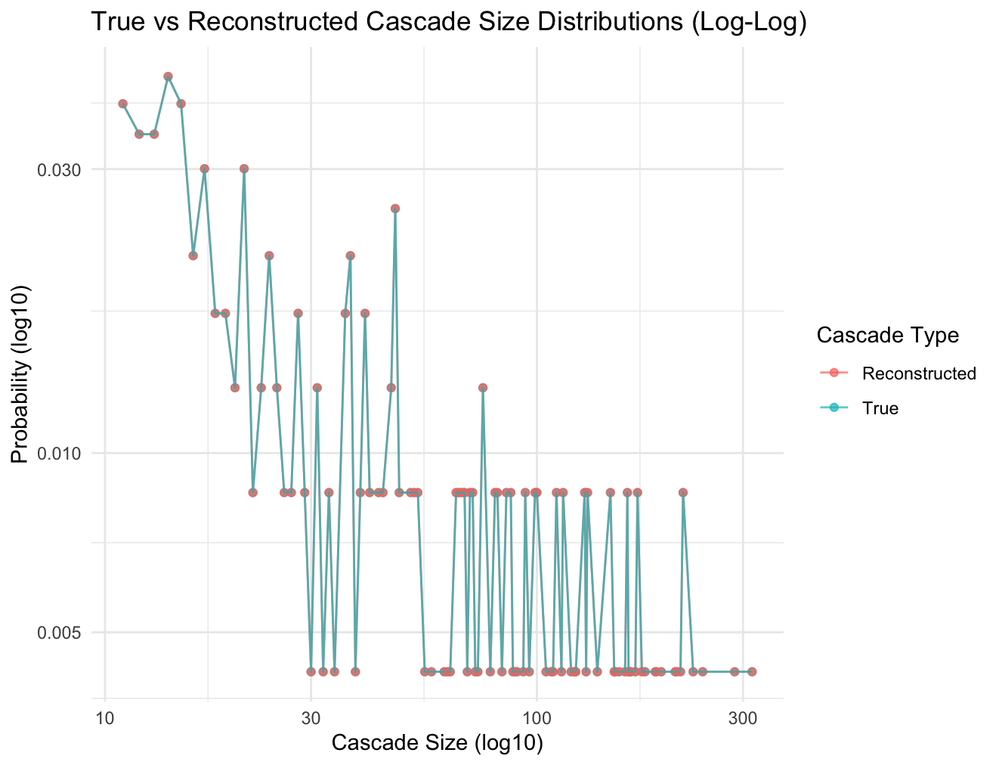

### 🌐 True vs Reconstructed Structural Virality
Both true and reconstructed cascades show matching virality distributions.
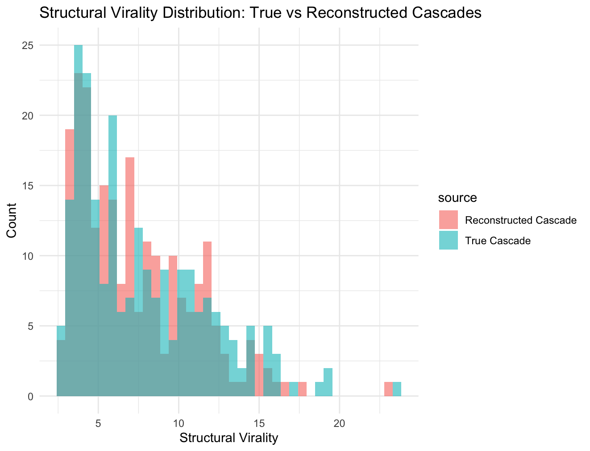

---

## 🧠 Key Findings

- **Most cascades remain small and shallow**, consistent with subcritical spreading.  
- **Structural virality** values cluster near broadcast-like diffusion (low average pairwise distance).  
- **Reconstructed cascades** preserve the overall size and depth distributions and approximate virality trends accurately.  
- The **Goel et al. (2016)** heuristic proves to be a strong baseline for deterministic cascade inference.

---

## 🧰 Tech Stack

- **Language:** R  
- **Libraries:** `igraph`, `ggplot2`, `tseries`, `zoo`, `CascadeSimulatoR`, `tidyverse`  
- **Data:** Synthetic ER networks and simulated activation sequences  
- **Visualization:** `ggplot2` (log-log plots, depth histograms, virality overlays)

---

## 🚀 How to Run

```bash
# Clone repository
git clone https://github.com/<your-username>/probabilistic-cascade-inference.git
cd probabilistic-cascade-inference

# Run simulations
Rscript simulate_icm.R
Rscript reconstruct_cascade.R
