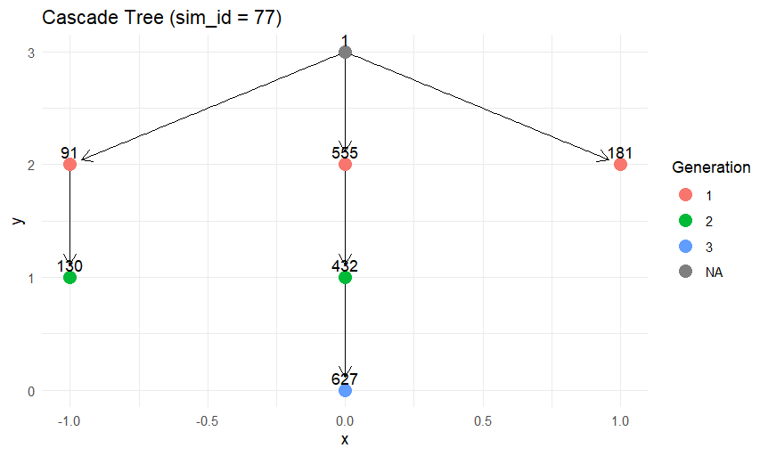

# Probabilistic Inference of Information Cascades on Social Media


## Overview

This repository contains the code, simulation outputs, figures, and preprint material for my MSc thesis project:

> **Probabilistic Inference of Information Cascades on Social Media**  
> **Author:** Prajwal Mahanawar  
> **Institution:** University of Limerick  
> **Programme:** MSc Data Science and Statistical Learning

The project studies how information spreads through social networks and how hidden cascade structures can be reconstructed when only activation events or activation times are available. It combines **forward diffusion simulation** using the **Independent Cascade Model (ICM)** with **cascade reconstruction** based on temporal ordering and network-neighbourhood constraints.

The work is useful for understanding social media diffusion, viral information spread, influence propagation, misinformation cascades, and network-based recommendation systems.

---

## Research Problem

In many real social platforms, we may observe *when* users become active, share content, or adopt information, but we often do not observe the true parent-child transmission path. This creates an inference problem:

> Given a social network and observed activation sequence, can we reconstruct a plausible cascade tree and preserve key structural properties of the original diffusion process?

This project addresses that problem through simulation, reconstruction, and statistical comparison of true and inferred cascades.

---

## Objectives

- Simulate information diffusion on small ring networks and larger Erdős–Rényi random graphs.
- Implement the Independent Cascade Model in R.
- Run Monte Carlo simulations to study cascade size distributions.
- Analyse how network density and activation probability influence cascade spread.
- Generate true cascade trees using `CascadeSimulatoR`.
- Reconstruct cascade trees from activation order and graph-neighbourhood information.
- Compare true and reconstructed cascades using size, depth, and structural virality.

---

## Methodology

### 1. Network Generation

The experiments use two types of networks:

- **Ring network** for simple step-by-step diffusion visualisation.
- **Erdős–Rényi random graph** using `sample_gnp(n, p)` from `igraph` for larger stochastic simulations.

### 2. Independent Cascade Model

The Independent Cascade Model assumes that once a node becomes active, it gets one chance to activate each inactive neighbour with probability `p`.

The implementation tracks:

- active and inactive nodes,
- newly activated nodes at each time step,
- activation history,
- final cascade size.

### 3. Monte Carlo Simulation

Multiple simulations are run to estimate cascade behaviour under stochastic diffusion. The main output is the cascade size distribution, often shown on a log-log scale.

### 4. Cascade Reconstruction

The reconstruction stage infers parent-child edges using:

- activation generation/time,
- network adjacency,
- candidate parents active in the previous generation,
- deterministic parent selection from valid neighbours.

This produces a reconstructed directed cascade tree that can be compared against the simulated true cascade.

### 5. Evaluation

The project compares true and reconstructed cascades using:

| Metric | Meaning |
|---|---|
| Cascade Size | Number of activated nodes in a cascade |
| Mean Depth | Average distance from root to activated nodes |
| Maximum Depth | Longest propagation path from the seed |
| Structural Virality | Average pairwise distance between nodes in a cascade tree |

---

## Repository Structure

```text
.
├── Test codes/
│   ├── test1ringnetwork.R
│   ├── test2montecarlo on ring.R
│   ├── test3montecarlo on ring with maxstepsize.R
│   ├── test4ERnetworksimulation.R
│   ├── test5ERnetworkwithdiff p values.R
│   ├── test6cascadesimpackage.R
│   ├── test7part1.R
│   ├── test7part2.R
│   ├── test7part3.R
│   └── test7reconstructcascade.R
│
├── output/
│   ├── test1possibleactivations.png
│   ├── test1ringnetworkformed.png
│   ├── test2cascadedist.png
│   ├── test3cascadedistwithmaxstepsize.png
│   ├── test4ERnetworkcascadesizedist.png
│   ├── test4activationstep0.png
│   ├── test4activationstep1.png
│   ├── test4activationstep2.png
│   ├── test5cascadedistwithdiffpvlues.png
│   ├── test6.png
│   ├── test6cascadesimtree7.png
│   ├── test6cascadesimtree77.png
│   ├── test6cascadetree25.png
│   ├── test7simid=32.png
│   ├── test7truevsrcavgdepth.png
│   ├── test7truevsrcdist.png
│   └── test7truevsrcsv.png
│
├── paper/
│   ├── arxiv.sty
│   ├── preprint.pdf
│   ├── references.bib
│   └── template.tex
│
├── requirements.txt
├── LICENSE.text
└── README.md
```

---

## Key Scripts

| Script | Purpose |
|---|---|
| `test1ringnetwork.R` | Builds a 6-node ring network and visualises possible activations. |
| `test2montecarlo on ring.R` | Runs Monte Carlo diffusion experiments on a ring graph. |
| `test3montecarlo on ring with maxstepsize.R` | Extends Monte Carlo simulation with a maximum step limit. |
| `test4ERnetworksimulation.R` | Simulates ICM on Erdős–Rényi networks and plots cascade size distributions. |
| `test5ERnetworkwithdiff p values.R` | Compares cascade distributions under different activation probabilities. |
| `test6cascadesimpackage.R` | Uses `CascadeSimulatoR` to generate cascade trees. |
| `test7reconstructcascade.R` | Reconstructs cascade trees from activation generations and network structure. |

---

## Results and Visualisations

### Ring Network Diffusion

The first experiment shows how a cascade spreads through a simple ring network.


### Cascade Size Distributions

Monte Carlo experiments show how often different cascade sizes occur.


### Erdős–Rényi Network Simulation

The project then moves from toy ring networks to larger Erdős–Rényi random graphs.


Example activation steps:

<p align="center">
  
  
  
</p>

### Effect of Different Activation Probabilities

Increasing activation probability changes cascade size behaviour and makes larger cascades more likely.


### Cascade Trees

True cascade trees are generated and visualised using the cascade simulation package.



### Reconstruction Results

The reconstruction experiment infers cascade trees from activation data.


True and reconstructed cascades are compared using depth, size distribution, and structural virality.


---

## Key Findings

- Most simulated cascades remain small, which is consistent with subcritical or weakly spreading diffusion settings.
- Higher activation probability increases the likelihood of larger cascades.
- Erdős–Rényi network density and infection probability strongly influence cascade reach.
- Reconstructed cascades can preserve important distributional properties of the original cascades.
- Temporal-ordering and neighbourhood-based reconstruction provides a useful baseline for cascade inference when direct transmission paths are unavailable.

---

## Tech Stack

### Main Tools

- **R**
- **igraph**
- **tidyverse**
- **ggplot2**
- **CascadeSimulatoR**
- **cowplot**

### Additional Python Requirements

The repository also contains a `requirements.txt` file with:

```text
networkx
numpy
pandas
matplotlib
scipy
```

These are useful if extending the project into Python-based graph analysis or cascade modelling.

---

## How to Run

### 1. Clone the Repository

```bash
git clone https://github.com/PrajwalMahanawar/Probabilistic-Inference-of-Information-Cascades-on-Social-Media.git
cd Probabilistic-Inference-of-Information-Cascades-on-Social-Media
```

### 2. Install R Packages

Open R or RStudio and run:

```r
install.packages(c("igraph", "tidyverse", "ggplot2", "cowplot"))

# If CascadeSimulatoR is not available directly from CRAN in your environment,
# install it using the method recommended by its package documentation.
install.packages("CascadeSimulatoR")
```

### 3. Run Individual Experiments

Because the scripts are organised as thesis experiments, run them individually:

```bash
Rscript "Test codes/test1ringnetwork.R"
Rscript "Test codes/test4ERnetworksimulation.R"
Rscript "Test codes/test7reconstructcascade.R"
```

For filenames with spaces, keep the quotation marks.

---

## Academic Context

This project was developed as part of an MSc thesis in Data Science and Statistical Learning at the University of Limerick. It connects ideas from:

- network science,
- probabilistic diffusion modelling,
- information cascade analysis,
- graph-based inference,
- social media propagation,
- cascade reconstruction.

The `paper/` directory contains preprint-related material, including LaTeX files, references, and a compiled PDF.

---

## Possible Extensions

Future work can extend this project by:

- testing reconstruction on real social media datasets,
- comparing ICM with Linear Threshold and Hawkes Process models,
- adding machine learning-based cascade prediction,
- using temporal point processes for activation-time modelling,
- applying cascade-aware features to recommender systems,
- evaluating reconstruction accuracy with edge-level precision and recall.

---

## Citation

If you use this repository or build on this work, please cite it as:

```bibtex
@misc{mahanawar2025cascades,
  author       = {Prajwal Mahanawar},
  title        = {Probabilistic Inference of Information Cascades on Social Media},
  year         = {2025},
  institution  = {University of Limerick},
  note         = {MSc Thesis Project},
  url          = {https://github.com/PrajwalMahanawar/Probabilistic-Inference-of-Information-Cascades-on-Social-Media}
}
```

---

## Author

**Prajwal Mahanawar**  
MSc Data Science and Statistical Learning  
University of Limerick

GitHub: [PrajwalMahanawar](https://github.com/PrajwalMahanawar)

---

## License

This project is provided for academic and research purposes. See `LICENSE.text` for license details.
